# Ticketing System Project Implementation Report

## Table of Contents
- [1. Introduction](#1-introduction)
- [2. Installation of Required Libraries](#2-installation-of-required-libraries)
- [3. Loading the Dataset](#3-loading-the-dataset)
- [4. Data Exploration](#4-data-exploration)
- [5. Text Cleaning Function](#5-text-cleaning-function)
- [6. Visual Analysis and Plotting](#6-visual-analysis-and-plotting)
- [7. Bilingual Text Processing](#7-bilingual-text-processing)
- [8. Counting Missing Values Before and After Cleaning](#8-counting-missing-values-before-and-after-cleaning)
- [9. Word Frequency Analysis](#9-word-frequency-analysis)
- [10. Feature Engineering](#10-feature-engineering)
- [11. Dimensionality Reduction using PCA](#11-dimensionality-reduction-using-pca)
- [12. Text Classification using Keywords](#12-text-classification-using-keywords)
- [13. Training and Evaluating the Random Forest Model](#13-training-and-evaluating-the-random-forest-model)
- [14. Training the SVM Model](#14-training-the-svm-model)
- [15. Visualizing PCA Results](#15-visualizing-pca-results)
- [16. Model Performance Summary](#16-model-performance-summary)
- [17. Conclusion and Future Work](#17-conclusion-and-future-work)
- [18. Overview of Git](#18-overview-of-git)
- [19. References](#19-references)

## 1. Introduction
This report outlines the implementation of a ticketing system project, focusing on text classification for ticket data. The project aims to automate the classification of service requests based on textual input, utilizing various machine learning techniques.

## 2. Installation of Required Libraries

- Install necessary libraries for data handling, modeling, and visualization:
  - **pandas**
  - **scikit-learn**
  - **matplotlib**
  - **seaborn**
  - **nltk**
  - **transformers**
  - **torch**
  - **arabic_reshaper**
  - **wordcloud**

## 3. Loading the Dataset
- Load the dataset from a CSV file into a pandas DataFrame.
  
- View the first few rows to understand its structure.
  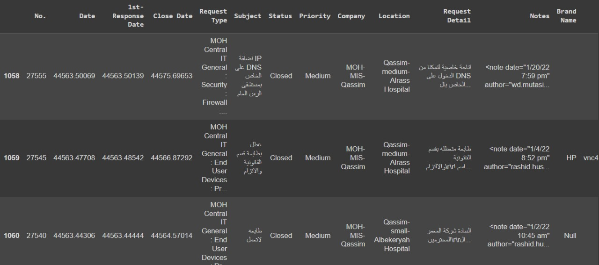

## 4. Data Exploration
- Explore the dataset to check for missing values and obtain summary statistics.
  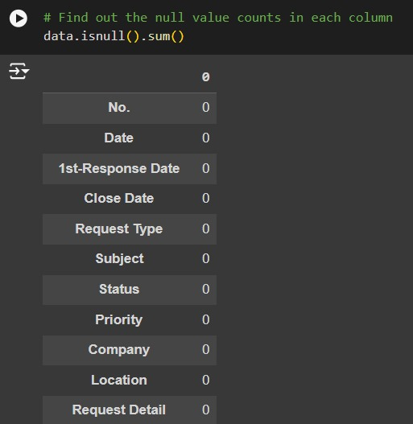

## 5. Text Cleaning Function
- Define a function to clean the text data by removing unnecessary content.
  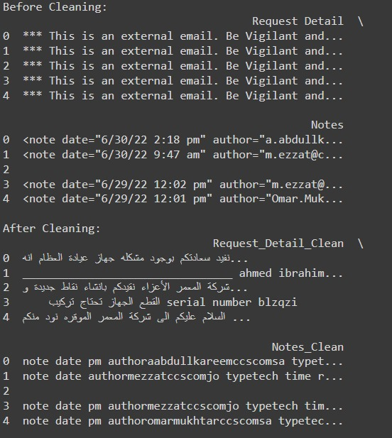

## 6. Visual Analysis and Plotting
- Create visualizations to illustrate data distribution and trends.

## 7. Bilingual Text Processing
- Prepare special processing for texts in both Arabic and English.
- Remove stopwords.

## 8. Counting Missing Values Before and After Cleaning
- Examine the number of missing values in original and cleaned text columns.

## 9. Word Frequency Analysis
- Perform word frequency analysis and visualize results with a word cloud.
  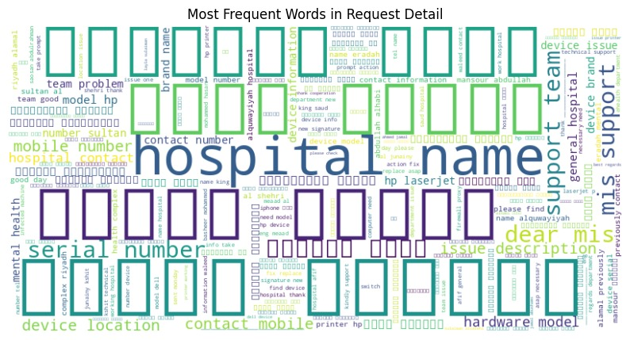

## 10. Feature Engineering
- Create new features based on text length and word count.
  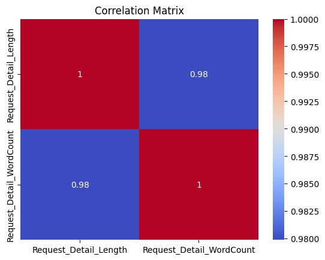

## 11. Dimensionality Reduction using PCA
- Apply PCA to reduce dimensions for better visualization and analysis.
  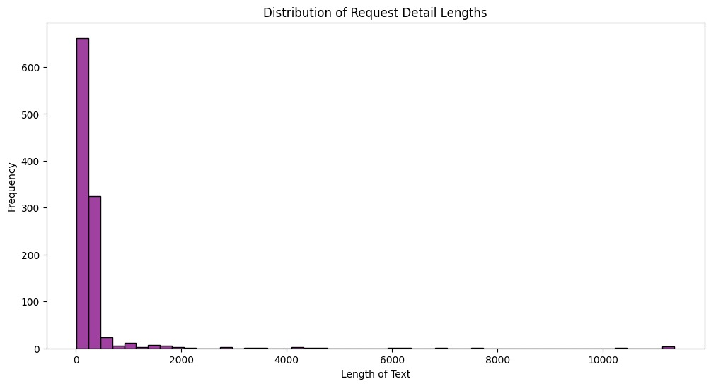 - 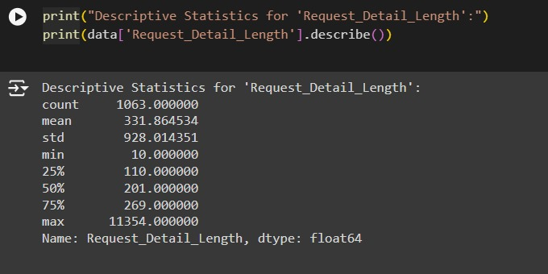

## 12. Text Classification using Keywords
- Define keywords to classify texts into different categories.
  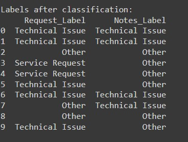

## 13. Training and Evaluating the Random Forest Model
- Prepare data for model training.
- Evaluate performance using a confusion matrix and statistical reports.

## 14. Training the SVM Model
- Implement the SVM model and evaluate performance.
  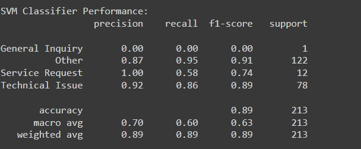
  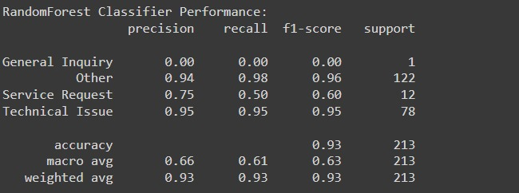

## 15. Visualizing PCA Results
- Visualize PCA results to observe data distribution in reduced-dimensional space.
  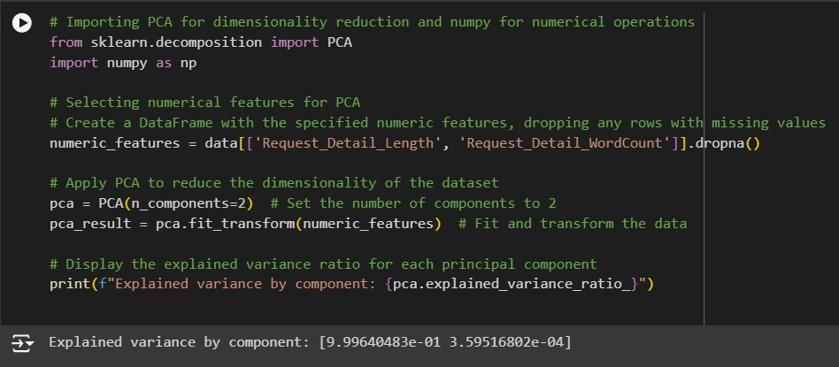

## 16. Model Performance Summary
- Summarize performance metrics of models for comparison.

## 17. Conclusion and Future Work
- Outline steps for processing, analyzing, and classifying ticket data.
- Suggest future improvements.

## 18. Overview of Git
Git is a distributed version control system designed to manage code changes and facilitate collaboration among developers. Below are the main topics related to Git, along with detailed explanations.

### 1. What is Git?
Git is a version control system that allows developers to track changes in their code, manage project history, and collaborate with others effectively. Unlike traditional version control systems, Git is distributed, meaning every developer has a complete copy of the repository, including its full history.

### 2. Key Features of Git
- **Distributed System**: Each user has their own local repository, providing complete autonomy and enabling work without internet access.
- **Version Control**: Git tracks changes to files, allowing users to revert to previous versions if necessary.
- **Branching and Merging**: Developers can create branches for new features or fixes, allowing for isolated development. Once a feature is complete, branches can be merged back into the main branch.
- **Collaboration**: Git facilitates teamwork by allowing multiple developers to work on different parts of a project simultaneously without conflicts.
- **Efficiency**: Git handles large projects and repositories efficiently, making common operations like commit, branch, and merge fast and responsive.

### 3. Common Git Commands
- **`git init`**: Initializes a new Git repository in the current directory.
- **`git clone <repository-url>`**: Creates a local copy of a remote repository.
- **`git add <file>`**: Stages changes in a file for the next commit.
- **`git commit -m "message"`**: Saves the staged changes to the repository with a descriptive message.
- **`git push`**: Sends local commits to a remote repository.
- **`git pull`**: Fetches changes from a remote repository and merges them into the local branch.
- **`git branch`**: Lists all branches in the repository and indicates the current branch.
- **`git checkout <branch>`**: Switches to a specified branch.
- **`git merge <branch>`**: Combines changes from the specified branch into the current branch.

### 4. Git Workflow
1. **Creating a Repository**: Use `git init` to create a new repository or `git clone <repository-url>` to clone an existing one.
2. **Making Changes**: Edit your files as necessary and use `git add` to stage the changes.
3. **Committing Changes**: After staging your files, use `git commit -m "message"` to commit your changes to the repository.
4. **Branching**: Create a new branch for new features or bug fixes using `git branch <branch-name>` and switch to it using `git checkout <branch-name>`.
5. **Merging**: Once development on the branch is complete, use `git merge <branch-name>` to merge the changes back into the main branch.
6. **Collaboration**: Share your changes with others using `git push` and incorporate changes from collaborators with `git pull`.

### 5. Advantages of Using Git
- **Backup and Redundancy**: Every developer has a full copy of the repository, which serves as a backup.
- **Experimentation**: The ability to create branches allows developers to experiment with new features without affecting the main codebase.
- **Change Tracking**: Git provides a detailed history of changes, making it easy to understand the evolution of a project.
- **Conflict Resolution**: Git has built-in tools to help resolve conflicts when multiple developers make changes to the same files.

## 19. References
- [Scikit-learn Documentation](https://scikit-learn.org/stable/documentation.html)
- [Pandas Documentation](https://pandas.pydata.org/docs/)
- [Natural Language Toolkit (NLTK)](https://www.nltk.org/)
- [Transformers Documentation](https://huggingface.co/docs/)
